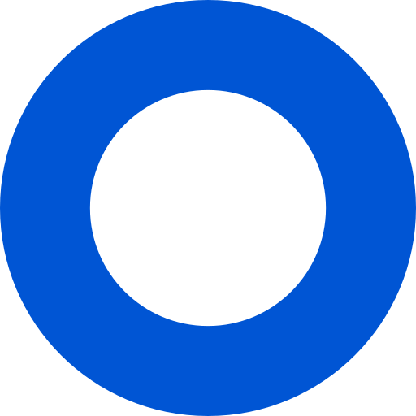

<p align="center">
  <h3 align = "center" > 🟣 Dashboard Icons </h3>
  <p align="center">
    <a href="https://www.jsdelivr.com/package/gh/walkxcode/dashboard-icons">
      
    </a>
  </p>

  <p align="center">
    ❤️ The best icons for your personal dashboard.
 <br/>
    <a href="#icons"> <strong > See the icons »</strong> </a>
 <br/>
 <br/>
</p>

# Table of Contents

- [Table of Contents](#table-of-contents)
- [Getting Started](#getting-started)
  - [Dashboards](#dashboards)
  - [Installation](#installation)
- [Icons](#icons)
- [Legal](#legal)

<!-- GETTING STARTED -->

# Getting Started

## Dashboards

There's multiple Dashboards available. Here are some of the popular ones.
<br />
_Dashboards with a \* have native integration with Dashboard Icons._

- [Homarr](https://github.com/ajnart/homarr)\*
- [Dashy](https://github.com/Lissy93/dashy)\*
- [Homer Dashboard](https://github.com/bastienwirtz/homer)
- [Heimdall](https://github.com/linuxserver/Heimdall)
- [Organizr(v2)](https://github.com/causefx/Organizr)
- [Flame](https://github.com/pawelmalak/flame)
- [SUI](https://github.com/jeroenpardon/sui)
- [Homepage](https://github.com/benphelps/homepage)\*

## Installation

**TIP! You can access Dashboard Icons online, faster, by using `https://cdn.jsdelivr.net/gh/walkxcode/dashboard-icons/png/example.png`**

To download an icon, simple `Right click > Save image`.

For non-desktop operating systems, or people that prefer to use terminal.

```sh
$ curl https://raw.githubusercontent.com/walkxcode/dashboard-icons/master/png/example.png > example.png
```

or

```sh
$ wget https://raw.githubusercontent.com/walkxcode/dashboard-icons/master/png/example.png - O example.png
```

# Icons

<!-- ICONS -->
                                                                                                                                                                                                                                                                                                                                                                                                                                                                                                                                                                                                                                                                                                                                                                                                                                                                                                                                                                                                                    
<!-- END ICONS -->

<!-- LEGAL -->

# Legal

(Almost) All product names, trademarks and registered trademarks in the images in this repository, are property of their respective owners. All images in this repository are used by the users of the Dashboard Icons project for identification purposes only.

The use of these names, trademarks and brands appearing in these image files, do not imply endorsement.

